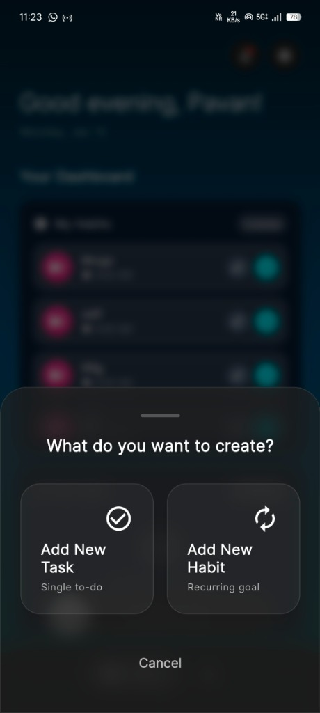
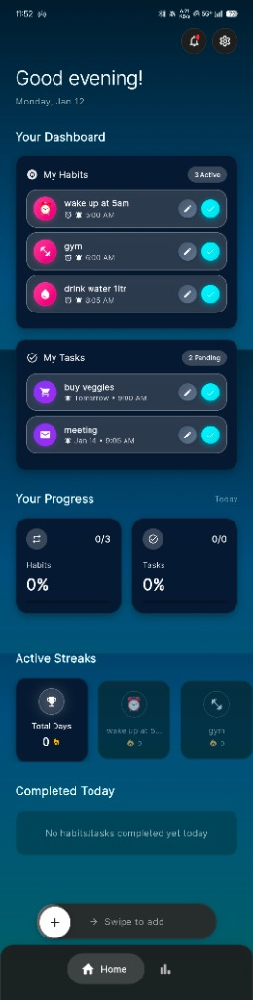
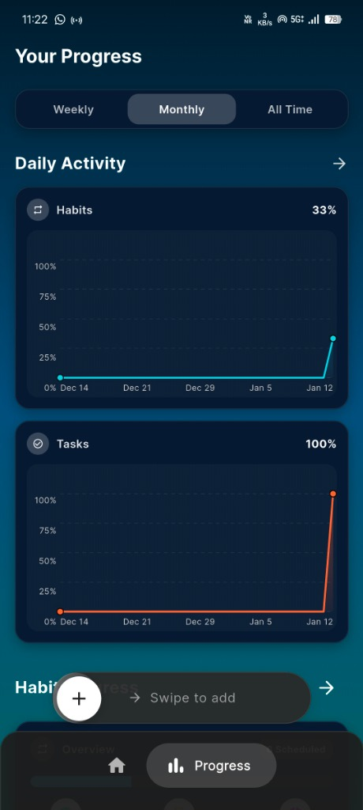
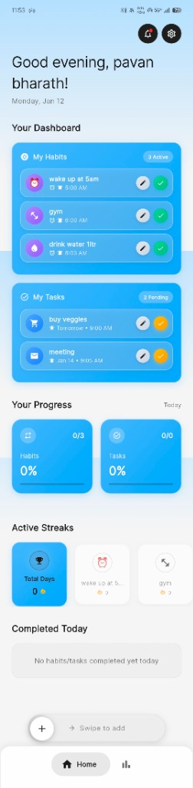
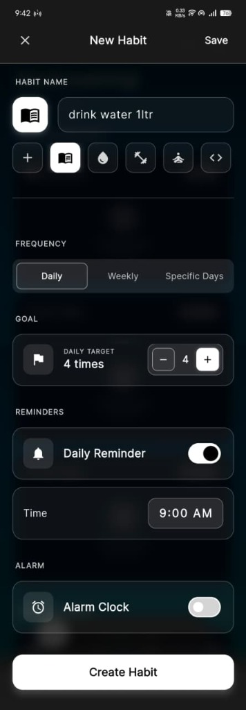
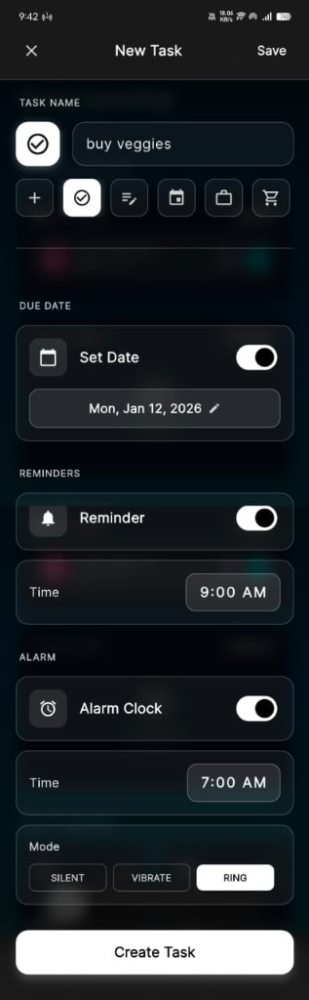

# Zyro - Build Better Habits

<div align="center">
  
</div>

Zyro is a premium, minimalist habit tracker designed to help you build and maintain positive routines. With a focus on simplicity, aesthetics, and offline privacy, Zyro offers a seamless experience for tracking your daily habits and tasks without the noise.

[](https://opensource.org/licenses/MIT)
[](https://flutter.dev/)

## 📱 Visual Experience

Experience a beautiful, fluid interface designed for both focus and ease of use.

### Dashboard & Analytics
<div align="center">
  
  
  
</div>

### Light Mode & Creation Flow
<div align="center">
  
  
  
</div>

## ✨ Key Features

- **Habit & Task Management**: flexible tracking for daily habits and one-off tasks.
- **Detailed Analytics**: Visualize your consistency with weekly and monthly progress charts.
- **Streak Calendar**: Stay motivated by seeing your streaks on a dedicated calendar view.
- **Smart Reminders**: Never miss a habit with reliable, exact-time notifications.
- **Minimalist Design**: A clean, distraction-free interface with support for both Dark and Light modes.
- **Offline First**: Your data stays on your device. No accounts, no cloud sync—just you and your habits.

## 🛠 Technical Architecture

Zyro is engineered for performance and reliability using a modern Flutter stack:

- **Framework**: [Flutter](https://flutter.dev/) (Dart)
- **State Management**: [Provider](https://pub.dev/packages/provider) for efficient state handling.
- **Local Database**: [Hive](https://pub.dev/packages/hive) for fast, synchronous, key-value storage.
- **Charts**: [fl_chart](https://pub.dev/packages/fl_chart) for rendering complex analytics.
- **Navigation**: [go_router](https://pub.dev/packages/go_router) for declarative routing.
- **Notifications**: [flutter_local_notifications](https://pub.dev/packages/flutter_local_notifications) for managing alarms and schedules.

### Permission Transparency (Android)

To deliver a reliable "Alarm" experience, Zyro utilizes specific high-privilege Android permissions. We believe in full transparency regarding their usage:

- **`SCHEDULE_EXACT_ALARM`**: Used to ensure notifications fire at the *precise* minute you set, bypassing battery optimizations that can delay standard notifications.
- **`USE_FULL_SCREEN_INTENT`**: Allows Zyro to wake your screen and show a full-screen alarm UI even when the device is locked, functioning as a true wake-up tool.
- **`WAKE_LOCK`**: Ensures the device CPU remains active while the alarm is ringing, so the sound isn't cut off by sleep mode.

## 🚀 Getting Started

1. **Clone the repository**:
   ```bash
   git clone https://github.com/pavanbharath15/zyro.apk.git
   ```
2. **Install dependencies**:
   ```bash
   flutter pub get
   ```
3. **Run the app**:
   ```bash
   flutter run
   ```

## 📄 License

This project is licensed under the MIT License - see the [LICENSE](LICENSE) file for details.
